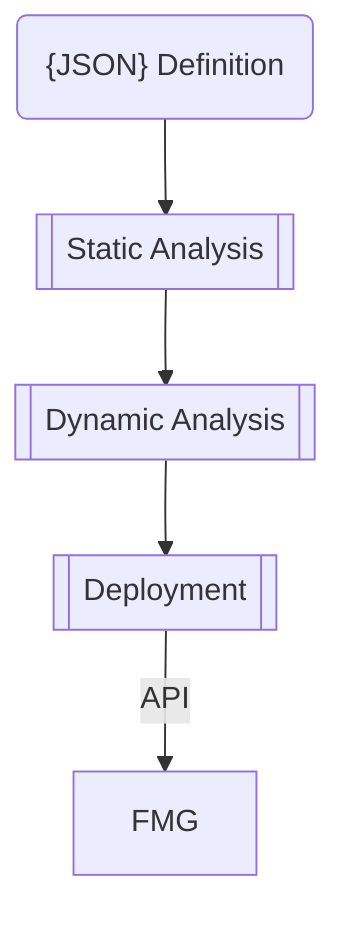

**Version:** 0.3

# FortiManager Pipeline

FortiManager Pipeline is a tool for configuring FortiManagers (FMGs) in a centralised "Infrastructure as Code" manner. It tries to find a comfortable ground between defining everything on the FortiManager, or defining everything in a structured textual format in a git repository. The following items are able to be defined using JSON and pushed to a FortiManager:

- ADOMs
- ADOM Meta Variables
- Model Devices
- Device Meta Variables

The position of FortiManager Pipeline is that if configuration tempates and policy packages are defined in a generic fashion using meta variables, they shouldn't change often. As such, there's little value in pulling their definitions outside of the FortiManager. But where there is value is by pulling the differences - the meta variables - into structured text. This allows you to quickly and easily see the differences at each site, crate new tenants (ADOMs) and devices easily, and use the variables in other scripts or automation outside of the FortiManager.

# Pipeline Flow

Here's a diagram that shows at a high-level the steps in the pipeline:



## JSON Definition

The definition of the ADOMs, devices, and variables is done within *fmg_config.json*. Here's an example of a simple definition of an ADOM with two devices, each with a per-device metavariable for their loopback address:

```json
{
    "adoms": [
        {
            "name": "tenant_001",
            "description": "Our one and only tenant",
            "devices": [
                {
                    "name": "device_1",
                    "serial": "FG60EPTK20010600",
                    "variables": [
                        { "name": "loopback", "value": "1.1.1.1" }
                    ]
                },
                {
                    "name": "device_2",
                    "serial": "FG60EPTK20010600",
                    "variables": [
                        { "name": "loopback", "value": "1.1.2.1" }
                    ]
                }
            ]
        }
    ]
}
```

A fully fledged config file can be viewed in the [examples folder](example/fmg_config.json), or you can view the [JSON schema](fmg_config.schema.json) which we'll talk about in the next section.

## Static Analysis 

Whenever a push is initiated that modified the *fmg_config.json* file, a github action in set off in the background. The first job of this action is to perform some static analysis on the JSON file. Some of the tests include (but are not limited to):

- Does the JSON file exist?
- Can we open the file?
- Is it valid JSON?
- Does the JSON adhere to the JSON schema?

That last point is probably the most important, and can help catch silly little errors well before you get to point of push the config to production. The JSON schema file it validates against is [fmg_config.schema.json](fmg_config.schema.json).

## Dynamic Analysis

If the static analysis passes, we move on to the dynamic analysis. In this job a licensed [container FortiManager](https://hub.docker.com/r/fortinet/fortimanager) is spun up, and the configuration is applied. This validates whether the configuration will (most likely) successfully apply to our production FortiManager.

A good example is the JSON I've included above. I tested this out and it passed the static analysis, but in the dynamic analysis I received this message:

```
- API Call Errror:  Serial number already in use
```

I then noticed that in the example I had used a duplicate serial number. This was caught before trying to run any API calls against prodiction.

This dynamic step does require that 

1. You have a *licensed and configured* FortiManager container image stored in the [GitHub Container Registry](https://docs.github.com/en/packages/working-with-a-github-packages-registry/working-with-the-container-registry) (GHCR).
1. You have created a token allowing the GitHub actions to be able to pull down the image.
1. You've modified the github actions within this repository to point to the URI of your image.

I'll add further details on the steps I used to create the licensed FortiManager image at a later stage.

## Deployment

If both the static analysis and dynamic analysis pass, the configuration is applied to a production device using HTTP JSON RPC calls to the FortiManager API. The script uses GitHub action secrets (Repo Settings -> Secrets -> Actions) to hold the URI of the FortiManager, the username, and the password of the user that is authorised to make API calls. The specific secret names are:

- FMG_API_URI
- FMG_API_USER
- FMG_API_PASS

At this stage the script **does not** check the validity of the management certificate on the FortiManager.

# What Doesn't It Do

This is a very early release of the pipeline, and you may run into bugs. If you see something, please do raise an issue.

It should be noted that the pipeline will never *delete* any ADOMs, devices, or variables. It will only ever create or update. This was done on purpose as

1. Erring on the safe side and not blowing away your infrastructure is generally considered a positive, and
1. It requires a lot more logic to determine what should and should not get deleted, which can get complicated and messy.

So if you need to delete something, remove it from the JSON, then manually remove it from the FortiManager

